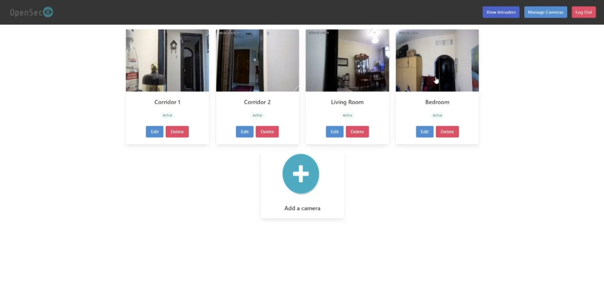
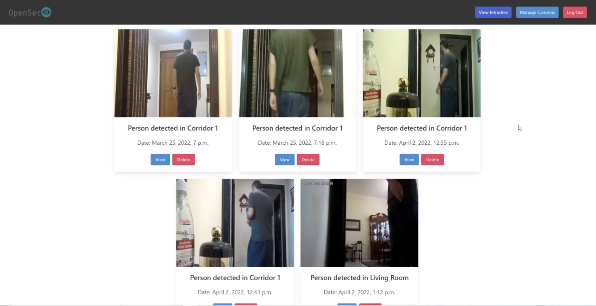
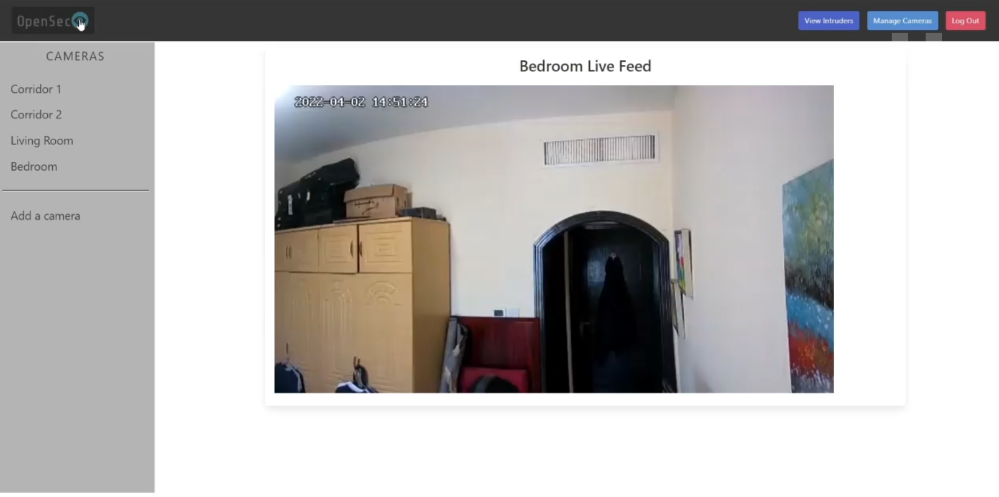

# OpenSec

OpenSec is a complete home surveillance and intruder detection system that emphasizes privacy and ease of use above all else. 

# Features
- All of OpenSec's components are stored locally on your own system, and none of its functionality requires a connection to a remote database or cloud provider
- Compatibility with any IP camera that supports the RTSP protocol (this includes Raspberry Pis with an attached camera module)
- Ability to view a live feed of each camera
- Automatic intruder detection that is resilient to false positives
- Automatic recording of detected intruders. These recordings will be stored on your own system and not anywhere else.
- Ability for intruder detection to work in different lighting conditions
- Metadata will be generated about intruders. This includes data about the time of the incident, the room the intruder was detected in, and whether or not the intruder was an animal or person
- Ability to work with multiple cameras
- Web-based dashboard where you can see a live feed of all the different cameras and view the recordings of detected intruders.

## Camera List

## Intruders List

## Camera Live Feed

